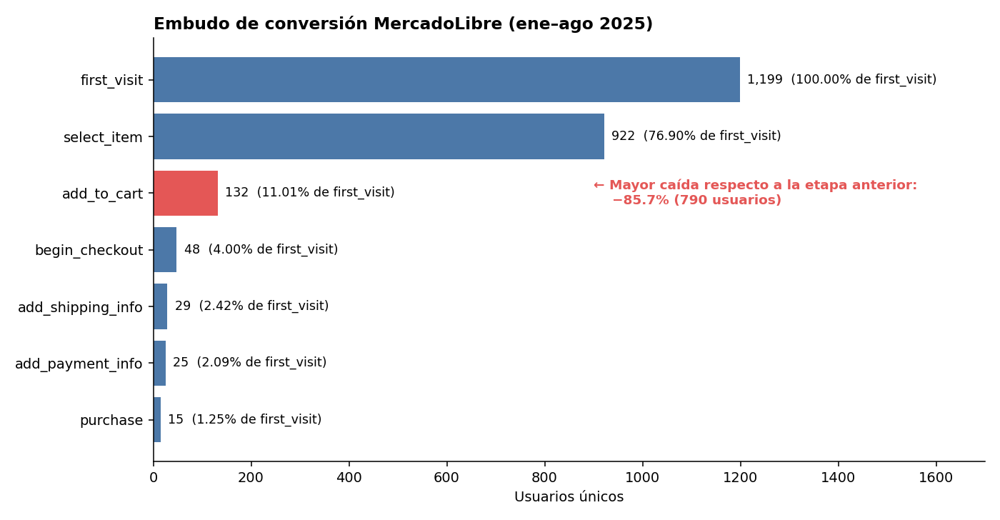
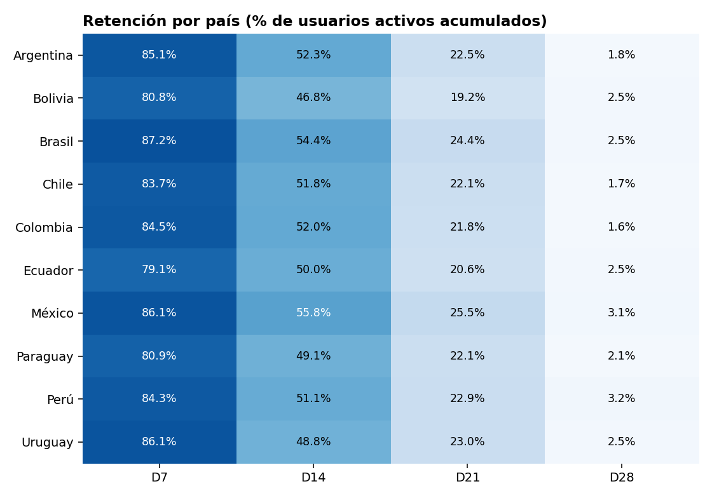
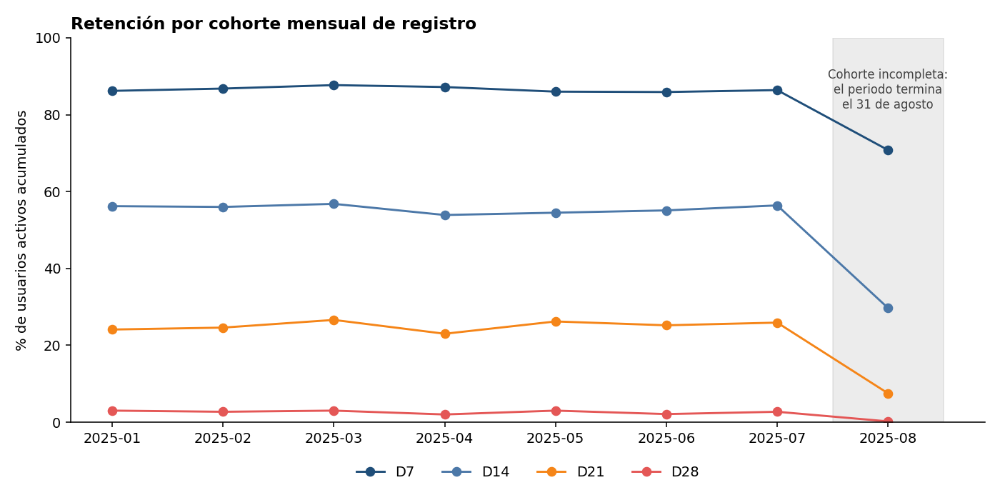

# MercadoLibre — Conversión y retención

**Herramientas:** SQL
**Periodo analizado:** 01/01/2025 – 31/08/2025

---

## 1. Pregunta de negocio

¿En qué etapa del recorrido del usuario se pierde la mayor parte de los usuarios nuevos, cómo cambia su retención con el paso de los días y en qué se diferencian los países?

## 2. Por qué importa

Cada usuario que se pierde en las primeras interacciones es una adquisición que ya se pagó y no generó compra. Saber dónde ocurre la caída y en qué países es más fuerte permite enfocar mejoras de onboarding y reactivación donde más impacto tienen.

## 3. Datos

Dos tablas con usuarios de varios países de LATAM (Argentina, Brasil, Chile, Colombia, Ecuador y Perú, entre otros):

| Tabla | Qué contiene | Columnas |
|---|---|---|
| `mercadolibre_funnel` | Eventos de navegación y compra de cada usuario | `user_id`, `session_id`, `event_name`, `event_times`, `country`, `device_category`, `platform`, `product_cat`, `price`, `currency`, `referral_source`, `event_date`, `year` |
| `mercadolibre_retention` | Actividad de cada usuario en los días posteriores a su registro | `user_id`, `signup_datetime`, `country`, `device_category`, `platform`, `activity_date`, `prob_active`, `day_after_signup`, `active`, `signup_date` |

**Eventos registrados en el embudo (17):** `first_visit`, `session_start`, `page_view`, `scroll`, `click`, `user_engagement`, `view_search_results`, `view_promotion`, `select_promotion`, `view_item`, `select_item`, `add_to_cart`, `begin_checkout`, `add_shipping_info`, `add_payment_info`, `purchase` y `repeat_purchase`.

- **Etapas del embudo analizado (7):** `first_visit` → `select_item` (incluye `select_promotion`) → `add_to_cart` → `begin_checkout` → `add_shipping_info` → `add_payment_info` → `purchase`.
- **Cortes de retención:** D7, D14, D21 y D28. Un usuario cuenta como retenido en D*N* si tiene `active = 1` en algún día con `day_after_signup >= N` (usuarios activos acumulados). La cohorte de cada usuario es el mes de su primer registro (`signup_date`).

## 4. Proceso

1. **Extracción y limpieza** de los usuarios registrados en el periodo, con SQL.
2. **Definición** de las etapas del embudo y de los cortes de retención (D7, D14, D21, D28).
3. **Cálculo de conversión** de cada etapa respecto a `first_visit`, con `ROUND` y `NULLIF` para evitar divisiones entre cero.
4. **Segmentación del embudo por país** (conversión de cada etapa por `country`).
5. **Cálculo de retención** por país y por cohorte mensual de registro, con `COUNT(DISTINCT CASE WHEN ...)`.
6. **Identificación** de los puntos de mayor caída y de diferencias entre países.
7. **Visualización** de tablas y gráficos del flujo de usuarios y la retención.

El código completo está en [`/sql`](./sql).

## 5. Hallazgos

### Embudo de conversión (usuarios únicos, ene–ago 2025)

| Etapa | Usuarios | % de la etapa anterior | % de first_visit |
|---|---:|---:|---:|
| first_visit | 1,199 | — | 100% |
| select_item | 922 | 76.9% | 76.90% |
| add_to_cart | 132 | 14.3% | 11.01% |
| begin_checkout | 48 | 36.4% | 4.00% |
| add_shipping_info | 29 | 60.4% | 2.42% |
| add_payment_info | 25 | 86.2% | 2.09% |
| purchase | 15 | 60.0% | 1.25% |

- **La mayor caída es entre `select_item` y `add_to_cart`:** de 922 usuarios que seleccionan un producto, solo 132 lo agregan al carrito. Se pierde el 85.7% de ellos (790 usuarios).
- Entre `first_visit` y `select_item` la caída es mucho menor: se pierde el 23.1% (277 usuarios).
- Solo **15 de 1,199 usuarios (1.25%)** completan una compra.
- Una vez que el usuario llega a `add_payment_info`, el 60% termina comprando (15 de 25).
### Embudo por país (% de los usuarios de `first_visit` de cada país que llega a la etapa)

| País | select_item | add_to_cart | begin_checkout | add_shipping_info | add_payment_info | purchase |
|---|---:|---:|---:|---:|---:|---:|
| Uruguay | 81.82 | 22.73 | 4.55 | 4.55 | 4.55 | 4.55 |
| Bolivia | 80.65 | 9.68 | 3.23 | 3.23 | 3.23 | 3.23 |
| México | 79.75 | 13.22 | 4.13 | 3.31 | 2.89 | 2.48 |
| Perú | 84.55 | 10.00 | 2.73 | 2.73 | 1.82 | 1.82 |
| Argentina | 75.00 | 8.75 | 4.38 | 1.88 | 1.88 | 1.25 |
| Chile | 78.35 | 17.53 | 8.25 | 3.09 | 2.06 | 1.03 |
| Brasil | 72.60 | 8.90 | 2.40 | 1.37 | 1.37 | 0.68 |
| Ecuador | 74.58 | 10.17 | 5.08 | 1.69 | 1.69 | 0.00 |
| Colombia | 76.36 | 9.70 | 4.85 | 3.03 | 2.42 | 0.00 |
| Paraguay | 71.43 | 9.52 | 0.00 | 0.00 | 0.00 | 0.00 |

- **En todos los países la caída fuerte ocurre en `add_to_cart`:** entre el 71% y el 85% de los usuarios selecciona un producto, pero solo entre el 9% y el 23% lo agrega al carrito.
- **Chile** tiene la mejor conversión a `begin_checkout` (8.25%), pero cae a 3.09% en `add_shipping_info`. Es la caída más marcada en ese paso entre los países con más usuarios.
- **Brasil** tiene la conversión a compra más baja entre los países que sí compraron (0.68%).
- **Ecuador, Colombia y Paraguay** no registran ninguna compra en el periodo.
- [CONFIRMAR: número de usuarios de `first_visit` por país. Los países con pocos usuarios (por ejemplo Uruguay, Bolivia y Paraguay) pueden mostrar porcentajes altos o de 0% con una sola compra, así que el orden por `conversion_purchase` no debe leerse como un ranking definitivo.]

- Validación: calculé la conversión de dos formas (uniendo cada etapa a la anterior y uniendo cada etapa directamente a `first_visit`) y ambas dieron los mismos conteos, lo que indica que todos los usuarios que llegan a una etapa pasaron por las anteriores.
### Retención por país (% de usuarios activos acumulados)

| País | D7 | D14 | D21 | D28 |
|---|---:|---:|---:|---:|
| Argentina | 85.1 | 52.3 | 22.5 | 1.8 |
| Bolivia | 80.8 | 46.8 | 19.2 | 2.5 |
| Brasil | 87.2 | 54.4 | 24.4 | 2.5 |
| Chile | 83.7 | 51.8 | 22.1 | 1.7 |
| Colombia | 84.5 | 52.0 | 21.8 | 1.6 |
| Ecuador | 79.1 | 50.0 | 20.6 | 2.5 |
| México | 86.1 | 55.8 | 25.5 | 3.1 |
| Paraguay | 80.9 | 49.1 | 22.1 | 2.1 |
| Perú | 84.3 | 51.1 | 22.9 | 3.2 |
| Uruguay | 86.1 | 48.8 | 23.0 | 2.5 |

- La retención cae de forma parecida en todos los países: alrededor de 80–87% en D7, 47–56% en D14, 19–26% en D21 y 2–3% en D28.
- **México** tiene la mejor retención en D14 (55.8%) y D21 (25.5%). **Bolivia** tiene la más baja en D14 (46.8%) y D21 (19.2%), y **Ecuador** la más baja en D7 (79.1%).
- Las diferencias entre países son de pocos puntos, así que el patrón general pesa más que las diferencias por país.

### Retención por cohorte mensual de registro

| Cohorte | D7 | D14 | D21 | D28 |
|---|---:|---:|---:|---:|
| 2025-01 | 86.2 | 56.2 | 24.1 | 3.0 |
| 2025-02 | 86.8 | 56.0 | 24.6 | 2.7 |
| 2025-03 | 87.7 | 56.8 | 26.6 | 3.0 |
| 2025-04 | 87.2 | 53.9 | 23.0 | 2.0 |
| 2025-05 | 86.0 | 54.5 | 26.2 | 3.0 |
| 2025-06 | 85.9 | 55.1 | 25.2 | 2.1 |
| 2025-07 | 86.4 | 56.4 | 25.9 | 2.7 |
| 2025-08 | 70.8 | 29.7 | 7.5 | 0.2 |

- Las cohortes de enero a julio son muy estables: D7 entre 85.9% y 87.7%, D14 entre 53.9% y 56.8%, D21 entre 23.0% y 26.6%.
- La cohorte de **agosto** parece mucho peor, pero probablemente se debe a que el periodo termina el 31 de agosto: los usuarios que se registraron en agosto no tuvieron tiempo de acumular 14, 21 o 28 días de antigüedad. No debe leerse como un deterioro real de la retención.

## 6. Recomendaciones

Cada recomendación parte de un dato de este análisis y es una hipótesis que se validaría con una prueba A/B.

1. **Reducir la fricción entre `select_item` y `add_to_cart`**, donde se pierde el 85.7% de los usuarios y que es la mayor caída en los 10 países. Probar un botón de agregar al carrito más visible en la ficha del producto y mostrar el costo de envío desde ese punto.
2. **Mostrar el costo y las opciones de envío antes del checkout**, porque entre `begin_checkout` y `add_shipping_info` se pierde cerca del 40% de los usuarios que ya iniciaron el pago.
3. **Enviar recordatorios de reactivación entre el día 7 y el día 21**, la ventana donde la retención baja de aproximadamente 85% a 25%, con mensajes dirigidos a quienes no regresaron a ver o comprar el producto que seleccionaron.
4. **Priorizar el onboarding en Bolivia y Ecuador**, los países con menor retención en D7–D21, usando a México como referencia. Dado que las diferencias son de pocos puntos, conviene confirmarlas con una prueba antes de invertir.

## 7. Limitaciones

- El embudo cuenta usuarios únicos y no verifica el orden en el tiempo de los eventos.
- El filtro `BETWEEN '2025-01-01' AND '2025-08-31'` puede dejar fuera los eventos del 31 de agosto posteriores a las 00:00 si `event_date` guarda hora.
- Al segmentar por país, algunos grupos tienen muy pocos usuarios, por lo que las diferencias entre países son indicativas y no concluyentes.
- La retención mide usuarios activos acumulados (`active = 1` en un día igual o posterior al hito), por lo que cada hito incluye al anterior y la cohorte de agosto queda truncada por el cierre del periodo (31 de agosto).
- La caída de D21 (~25%) a D28 (~2–3%) es muy pronunciada y conviene confirmar con la distribución de `day_after_signup` que no se deba al rango de datos disponible.
- La muestra del embudo es pequeña (1,199 usuarios), por lo que los porcentajes de las últimas etapas (15 compras) son poco estables.

## 8. Evidencias

**Embudo de conversión**



**Retención por país**



**Retención por cohorte mensual**



## 9. Estructura del repositorio

```
mercadolibre-funnel-retention-analysis/
├── README.md
├── sql/
│   ├── 01_exploracion_esquema.sql
│   ├── 02_1_embudo_conteo.sql
│   ├── 02_2_embudo_conversion.sql
│   ├── 02_3_embudo_por_pais.sql
│   ├── 03_1_usuarios_activos_pais.sql
│   ├── 03_2_retencion_pais.sql
│   ├── 03_3_cohorte_registro.sql
│   └── 03_4_retencion_cohorte.sql
└── images/
    ├── embudo.png
    ├── retencion_pais.png
    └── retencion_cohorte.png
```
